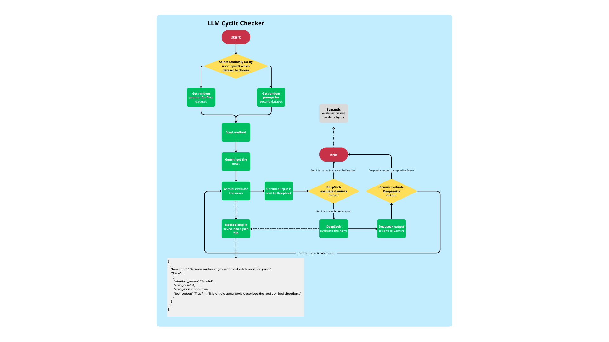

# 🔃 Cyclic-LLM-Checker
Repository for the "Semantic web &amp; Social network" Project. Here there are all the information regarding the methodology used, the used datasets and an exploration of the datasets used for the project.

## 🔎 Exploration of the datasets
The exploration of the datasets can be found in the ```notebooks``` folder. 

## ▶️ How to run the project
- The project is based on `Python 3.12.2`. Make sure to have a compatible version of Python installed.
To check your Python version, run the following command in your terminal:
```
python --version
```
- Some libraries are required to run the notebooks. You can find the list of required libraries in the `requirements.txt` file. You can install them running the following command inside the project root folder:
```
cd Cyclic-LLM-Checker
pip install -r requirements.txt
```

To run the notebooks, you can use VSCode with the [Jupyter](https://marketplace.visualstudio.com/items?itemName=ms-toolsai.jupyter) extension installed.

## 👥 Team management
- Gabriel Pesce
    - Repository manager
    - Notebooks developer (Analysis, Preprocessing and Introductory)
    - Program developer (Code of classes and functions to run the project)
- Tidiane Bengriche
    - Notebooks developer (Analysis, Preprocessing)
- Małgorzata Gierdewicz
    - Methodology tester
    - Methodology evaluator

## 📚 Methodology proposed
The methodology proposed is a cyclic verification between two LLMs: Gemini and DeepSeek. The process is as follows:
1. The user provides an input to Gemini.
2. Gemini generates an output.
3. DeepSeek evaluates Gemini's output to verify its reliability.
4. If the output is reliable, it is returned to the user.
5. If the output is not verified, DeepSeek generates a new output based on Gemini's output.
6. The output is evaluated by Gemini.
7. Gemini performs the same process as DeepSeek to verify the new output.
8. Loop until the output is reliable.
Note: to avoid infinite loops, a maximum number of iterations is set to a predefined value.
The main goal of this methodology is to leverage the strengths of both LLMs to improve the reliability of the outputs provided to the user, in order to minimize the risk of misinformation.

## 📊 Concept Flowchart


## 🔑 About API Keys
This project integrates two different LLM providers: Gemini and DeepSeek.
To run the code locally and compare how the two models behave, you will need to provide two API keys, one for each service.
### 🔷 Gemini
Obtaining a Gemini key is straightforward and completely free.
- Visit the official documentation page: https://ai.google.dev/gemini-api/docs
- From the top navigation bar, open the API Keys section.
- Create a new key by choosing a project name and a token name.
- Once generated, set it as an environment variable: `GEMINI_API_KEY="your_key_here"`
### 🐋 DeepSeek
- A DeepSeek API key can be created from the official dashboard: https://api-docs.deepseek.com/
- The process is similar to Gemini: choose a name and generate a token. However, DeepSeek requires a minimum top-up of $2 before you can make API requests. This limitation will be addressed in future versions of the project, so users will be able to test the method without needing to pay upfront.
- Once you have the key, add it as an environment variable: `DEEPSEEK_API_KEY="your_key_here"`
